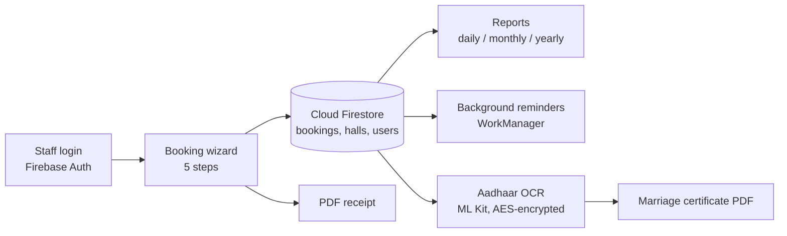

# Puranika Sadana — Wedding Hall Management App

A cross-platform Flutter app that digitalizes day-to-day operations of a wedding hall in Sri Kshetra Kollur, Karnataka: bookings, catering and pricing, payments, marriage certificates, reports and reminders. The interface is available in **English and Kannada**.

> **Status:** feature-complete, in pre-production testing.

## App at a glance

The side menu gives staff seven areas:

| Screen | What it does |
|---|---|
| **Dashboard** | Today's overview, hall status, upcoming-event banner and reminders, quick actions |
| **My Bookings** | Searchable list of bookings with status, balance due, edit, receipt and certificate actions |
| **Calendar** | Day-by-day hall availability |
| **Halls** | Hall details: capacity, facilities, photos, rates |
| **Reports** | Revenue summaries and balance-due lists |
| **Pricing Settings** | Hall packages, catering rates, add-on prices, reminder windows |
| **Settings** | Language (English / Kannada), logo, payment QR code, logout |

## How it works



## Features

- **Authentication and access control** — Firebase email/password login; accounts must exist in the `users` collection and be marked active, with a role attached.
- **5-step booking wizard** — event details, hall selection, catering and add-ons, payments, and confirmation, with state managed by Riverpod.
- **Configurable pricing engine** — hall packages, catering tiers (per-plate rates), add-ons (palav/salad, poori sagu, ice cream, water bottles), discounts, cleaning and music charges, all editable from the Pricing Settings screen.
- **Calendar and hall management** — per-day availability across halls, plus hall details (capacity, facilities, photos, rates).
- **Payments** — advance and balance collection with a running outstanding balance per booking.
- **PDF generation** — printable/shareable receipts and marriage certificates (Kannada and English text rendering) using `pdf` and `printing`.
- **Marriage certificate workflow** — scan Aadhaar cards on-device with Google ML Kit OCR, review and correct the extracted fields, and generate the certificate. Aadhaar numbers are AES-encrypted before they are stored.
- **Reports** — daily, monthly and yearly revenue summaries, hall-wise breakdowns, and balance-due lists, with `fl_chart` charts.
- **Reminders** — background checks (WorkManager) and local notifications for upcoming events and pending balances, with admin-configurable reminder windows.
- **Localization** — English and Kannada via ARB files.
- **Offline-friendly settings** — pricing and reminder preferences are cached locally with `shared_preferences`.

## Tech stack

| Area | Tools |
|---|---|
| Framework | Flutter (Dart 3) — Android, iOS, web, desktop targets |
| State management | Riverpod (`flutter_riverpod`) |
| Navigation | `go_router` |
| Backend | Firebase Auth, Cloud Firestore, Firebase Storage |
| On-device ML | Google ML Kit text recognition |
| Documents | `pdf`, `printing`, `share_plus` |
| Background work | `workmanager`, `flutter_local_notifications` |
| Charts | `fl_chart` |
| Security | `encrypt` (AES) |

## Project structure

```
lib/
├── app/                  # router, theme
├── core/                 # constants, services (pricing, settings, notifications, background), utils
├── features/
│   ├── authentication/   # login, password reset, session
│   ├── dashboard/        # bookings, calendar, halls, wizard, settings (data / domain / presentation)
│   └── reports/          # report providers
├── l10n/                 # English and Kannada strings
├── screens/              # certificate and Aadhaar-scan flows
└── services/             # receipt, certificate and report generators
```

## Getting started

### Prerequisites
- Flutter SDK (Dart `^3.11.3`)
- A Firebase project with Authentication (email/password), Firestore and Storage enabled

### Setup

1. Clone the repository and fetch packages:
   ```bash
   git clone https://github.com/24F2002740/puranika_sadana.git
   cd puranika_sadana
   flutter pub get
   ```
2. Connect your own Firebase project (`google-services.json` is **not** committed):
   ```bash
   dart pub global activate flutterfire_cli
   flutterfire configure
   ```
   This regenerates `lib/firebase_options.dart` and places `android/app/google-services.json`.
3. In Firestore, create a document in the `users` collection for each staff account, keyed by the user's Firebase Auth UID:
   ```json
   { "email": "staff@example.com", "role": "admin", "active": true }
   ```
4. Run the app with an encryption key for Aadhaar data (exactly 32 characters):
   ```bash
   flutter run --dart-define=AADHAAR_ENCRYPTION_KEY=<your-32-character-key>
   ```
   Never commit the real key.

## Security notes

- Firebase config files and signing keys are git-ignored.
- Aadhaar numbers are encrypted at rest with AES; the key is supplied at build time via `--dart-define`.
- Firestore and Storage rules in this repo currently allow any authenticated user. **Tighten them to role-based access before production use.**

## Roadmap

- Role-based Firestore/Storage security rules
- Per-record random IV for Aadhaar encryption
- Unit tests for the pricing and report services
- Double-booking checks at write time

## License

All rights reserved. Contact the author for permission to reuse.
